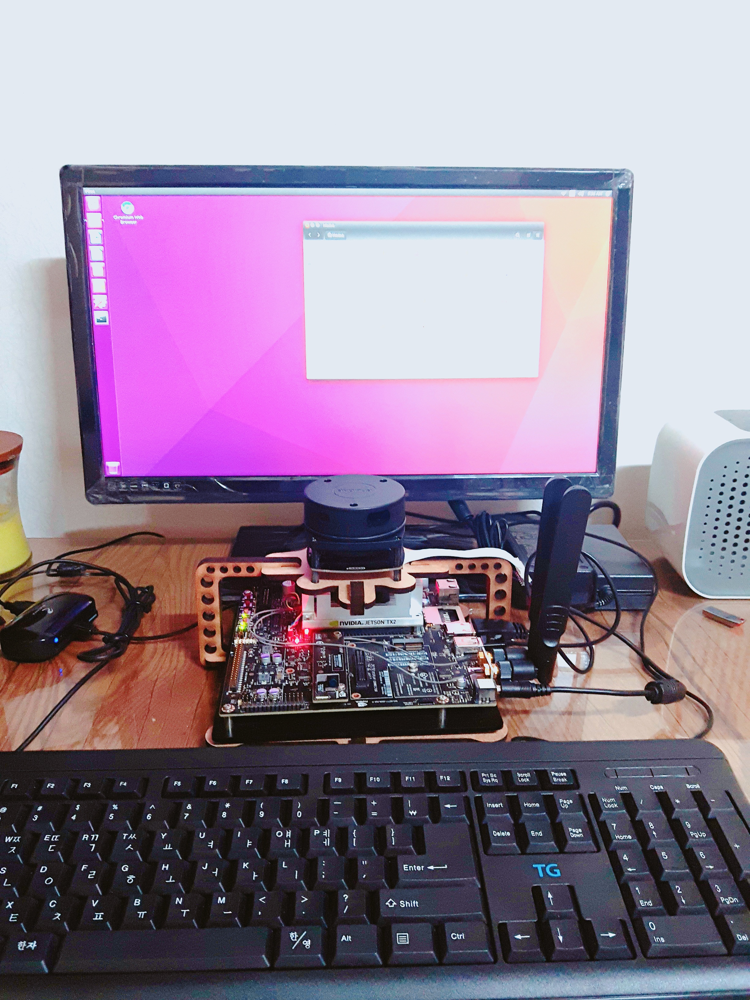
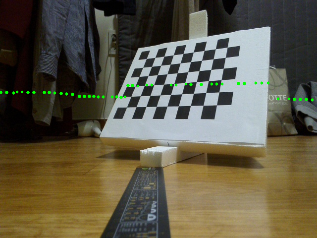

# 2D-LiDAR Camera Calibration

### Introduction

This one is about extrinsic calibration of 2D Lidar and Camera. I used ROS for get points from 2D lidar. See this [paper](http://citeseerx.ist.psu.edu/viewdoc/download?doi=10.1.1.80.7118&rep=rep1&type=pdf) for a theoretical explanation.

In this experiment, I used RPLidar-A1 and NVIDIA TX2 on-board camera. If you have different lidar or camera, it's fine.

### Requirements

* ROS Kinetic
* MATLAB

### Preparation

Before using this, you have to prepare some datasets. Specific explanation is in the paper which mentioned above. In my case, I got 20 datasets which are pictures of checkerboard and lidar points in all different pose of checker board.

First, fixing your checker board and your tools(like camera and lidar).

Second, take picture and also get lidar points(using rosbag).

Third, change checker board's pose and repeat 1st and 2nd about 20 times.

Fourth, do camera calibration using [matlab camera calibration toolbox](http://www.vision.caltech.edu/bouguetj/calib_doc/). You will get calib_Results.mat file.

Fifth, using rosbag for transform point data as bin file.(using python ros nodes which are in prepare directory)

Sixth, extract only points which on checkerboard. And make points_data.m file. (you can see sample points_data.m in sample data directory)

### Calibration

Using LaserCamCali.m in calibration directory. Then you will get rotation matrix and translation vector.

### Test

Before test your rotation matrix and translation vector, you should change the code in transform_test.py which is in calibration directory. Change PHI(rotation matrix) and DELTA(translation vector) in that python code which are in line 4 and 5.

### Result

